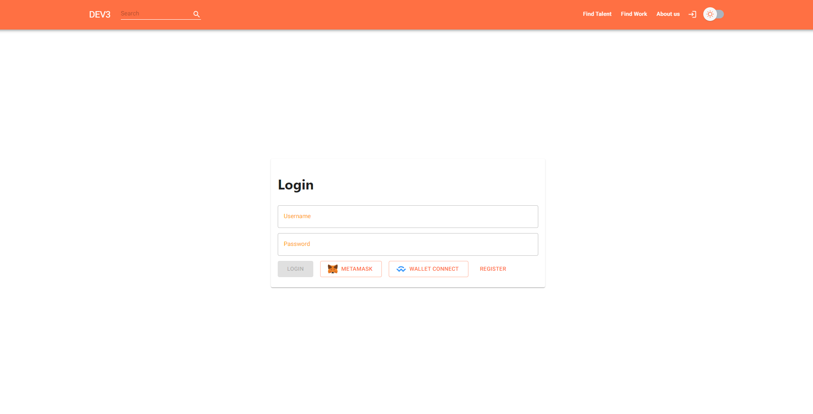

This is a [Next.js](https://nextjs.org/) project bootstrapped with [`create-next-app`](https://github.com/vercel/next.js/tree/canary/packages/create-next-app).

## Getting Started

First, run the development server:

```bash
npm run dev
# or
yarn dev
```

Open [http://localhost:3000](http://localhost:3000) with your browser to see the result.

You can start editing the page by modifying `pages/index.tsx`. The page auto-updates as you edit the file.

[API routes](https://nextjs.org/docs/api-routes/introduction) can be accessed on [http://localhost:3000/api/hello](http://localhost:3000/api/hello). This endpoint can be edited in `pages/api/hello.ts`.

The `pages/api` directory is mapped to `/api/*`. Files in this directory are treated as [API routes](https://nextjs.org/docs/api-routes/introduction) instead of React pages.

## About the project

Developed basic features of the website such as crypto wallet authentication, browsing, writing and liking articles which are stored in a MongoDB database that I designed. 

I adopted modern web development tools such as React and NextJS and learnt a lot about concepts such as React state, hooks, incremental static regeneration, server side rendering etc.

Deploying Website soon!!!

## Log in page preview


You can log in with a crypto wallet (this functionality was made possible by Moralis SDK) or you can log in with just your username and your password. Your credentials are stored in the MongoDB database and your passwords are safe.

## All articles page preview (Night Mode is on here)


The articles are fetched with getStaticProps (with revalidate) and all content appears in SEO (Search engine optimization). You can click any article to read it.


## Write article page preview


You can write your own article by clicking at the "Write" button in the navbar. I used MDXjs - a JS library that takes Markdown input and renders it for the user. You have to use Markdown to write your articles, but I'm planning to add a Rich text editor too to make it easier for the users. 

## Read article page preview (Night Mode is on here)


By clicking at an article, you are shown a page with the rendered Markdown content. It's possible to like and unlike articles, and the rating of every article is stored in the database and fetched whenever it is shown to you.
